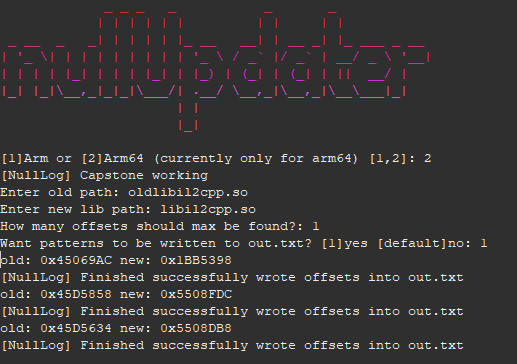

# NullUpdater
Update arm/arm64 offsets in an instant for compiled libraries like libil2cpp etc...

Java Developement Kit is needed

Use:
- Download the NullUpdater.jar from releases tab have binaries ready and have an offsets.txt file where the old offsets are declared each line with 0x prefix in hexadecimal
 example:
```
#how your offsets.txt might look hashtag at start will ignore the line
0x12345
0xDEAD
0xFED
0xACE
0xFFFF
```
  
- run `java -jar nullUpdater.jar`

or build it yourself and run

# Preview



